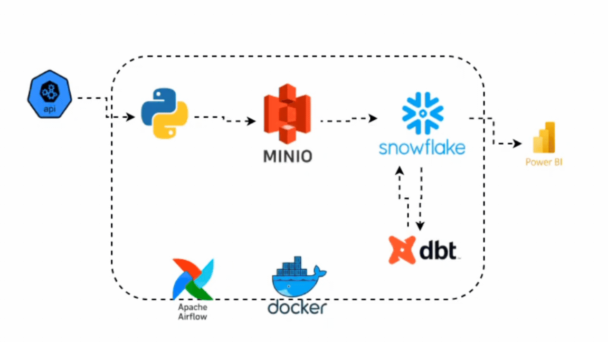
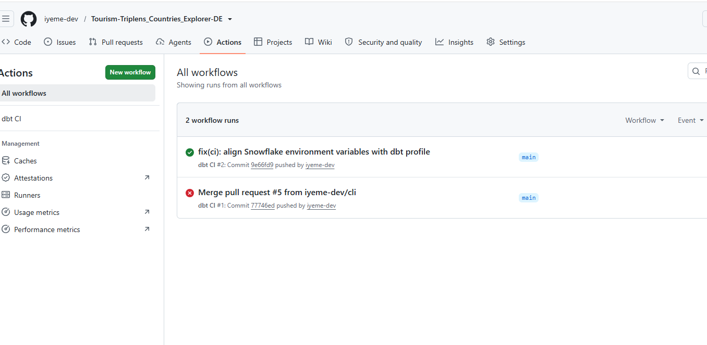
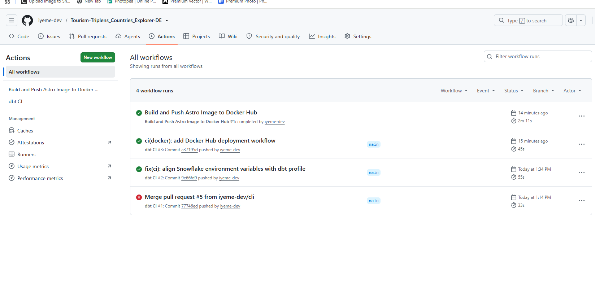
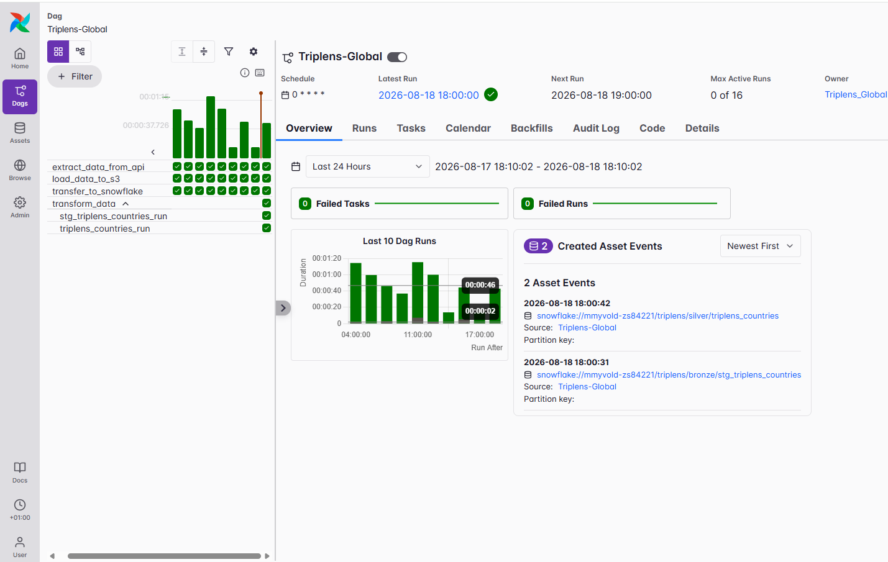

# Tourism Triplens Countries Explorer - Data Engineering Project

## Background

Tourism-Triplens_Countries_Explorer-DE is an end-to-end data engineering project designed to collect, store, transform, orchestrate, and automate tourism and country-related data.

The project retrieves country information from an external API, stores the raw JSON data in MinIO object storage, transfers the data into Snowflake, and transforms the data using dbt.

Apache Airflow is used to orchestrate the complete pipeline, while GitHub Actions provides CI/CD automation for validating dbt transformations and building and deploying the project Docker image to Docker Hub.

The project demonstrates a production-style data engineering workflow using Python, MinIO, Snowflake, dbt, Apache Airflow, Docker, Astronomer, GitHub Actions, and Docker Hub.

---

## Table of Contents

1. [Project Overview](#project-overview)
2. [Architecture](#architecture)
3. [Tech Stack](#tech-stack)
4. [Data Pipeline Flow](#data-pipeline-flow)
5. [Data Ingestion](#data-ingestion)
6. [MinIO Object Storage](#minio-object-storage)
7. [Snowflake Data Warehouse](#snowflake-data-warehouse)
8. [dbt Transformation](#dbt-transformation)
9. [Bronze Layer](#bronze-layer)
10. [Silver Layer](#silver-layer)
11. [Airflow Orchestration](#airflow-orchestration)
12. [CI/CD with GitHub Actions](#cicd-with-github-actions)
13. [Docker Deployment](#docker-deployment)
14. [Environment Variables](#environment-variables)
15. [Setup and Installation](#setup-and-installation)
16. [Running the Pipeline](#running-the-pipeline)
17. [Monitoring the Pipeline](#monitoring-the-pipeline)
18. [Troubleshooting](#troubleshooting)
19. [Best Practices](#best-practices)
20. [Key Takeaways](#key-takeaways)
21. [Project Screenshots](#project-screenshots)

---

## Project Overview

This project implements a modern batch data engineering pipeline for collecting and transforming country and tourism-related information.

The pipeline starts by retrieving data from an external API using Python. The raw response is stored as JSON in MinIO, which acts as the project's object storage layer.

The data is then transferred from MinIO into Snowflake where it is initially stored in a raw table.

dbt is used to transform the semi-structured Snowflake data through Bronze and Silver transformation layers.

Apache Airflow orchestrates the complete workflow and ensures that the ingestion and transformation tasks execute in the correct order.

GitHub Actions provides CI/CD automation to validate dbt models and build and push a Docker image to Docker Hub after successful CI execution.

### Key Features

- Country and tourism data extraction from an external API
- Python-based modular data ingestion
- MinIO object storage for raw JSON files
- Snowflake cloud data warehouse
- Semi-structured JSON processing using Snowflake
- dbt transformation models
- Bronze and Silver transformation layers
- Apache Airflow workflow orchestration
- Astronomer local Airflow environment
- Scheduled pipeline execution
- GitHub Actions CI workflow
- Docker image build and deployment
- Docker Hub image repository
- Secure secrets management using environment variables and GitHub Secrets
- Git and GitHub version control

---

## Architecture

### Data Pipeline Architecture



### Architecture Flow

```text
External API
     |
     v
Python Extraction
     |
     v
MinIO Object Storage
     |
     v
Snowflake RAW Layer
     |
     v
dbt Bronze Layer
     |
     v
dbt Silver Layer
     |
     v
Analytics-Ready Country Data
```

The complete workflow is orchestrated by Apache Airflow.

CI/CD is handled through GitHub Actions:

```text
Developer Push / Merge
          |
          v
     GitHub Actions
          |
          v
        dbt CI
          |
      CI Success
          |
          v
Docker Image Build
          |
          v
      Docker Hub
```

---

## Tech Stack

| Tool | Purpose |
|---|---|
| Python | API extraction and data pipeline logic |
| Requests | HTTP communication with the external API |
| MinIO | S3-compatible object storage |
| Boto3 | Python client for interacting with MinIO |
| Snowflake | Cloud data warehouse |
| Snowflake Connector | Python-to-Snowflake connectivity |
| dbt | SQL transformation and modelling |
| Apache Airflow | Pipeline orchestration |
| Astronomer | Local Airflow development environment |
| Docker | Containerisation |
| Docker Compose | Supporting container services |
| GitHub Actions | CI/CD automation |
| Docker Hub | Docker image registry |
| Git | Version control |
| GitHub | Source code repository and collaboration |

---

## Data Pipeline Flow

```text
API
 |
 v
Extract JSON
 |
 v
MinIO Bucket
 |
 v
Snowflake RAW
 |
 v
dbt Bronze
 |
 v
dbt Silver
```

### Pipeline Tasks

```text
extract_data_from_api
        |
        v
load_data_to_s3
        |
        v
transfer_to_snowflake
        |
        v
transform_data
        |
        +--------------------------+
        |                          |
        v                          v
stg_triplens_countries_run   triplens_countries_run
```

---

## Data Ingestion

Python is used to connect to the external country information API.

The ingestion code is separated into reusable modules:

The extraction layer is responsible for:

- Connecting to the external API
- Sending authenticated API requests
- Retrieving country information
- Returning JSON data
- Passing the API response to downstream Airflow tasks

---

## MinIO Object Storage

MinIO is used as the project's object storage layer and acts as the landing zone for raw API data before it is loaded into Snowflake.

Bucket:

```text
triplens
```

Raw object path:

```text
raw/triplens_global.json
```

Example local ports:

```text
9100 -> MinIO API
9101 -> MinIO Console
```

---

## Snowflake Data Warehouse

Snowflake is used as the cloud data warehouse.

Database:

```text
TRIPLENS
```

Example layer structure:

```text
TRIPLENS
├── RAW
├── BRONZE
└── SILVER
```

Raw table:

```text
TRIPLENS.RAW.COUNTRIES_RAW
```

The raw data retains the original semi-structured JSON representation for reproducible downstream transformation.

---

## dbt Transformation

The dbt project is located at:

```text
dbt/triplens/
```

Models are organised into:

```text
models/
├── bronze/
└── silver/
```

The Snowflake connection is configured through `profiles.yml` using environment variables:

```yaml
account: "{{ env_var('SNOW_ACCOUNT') }}"
password: "{{ env_var('SNOW_PASSWORD') }}"
user: "{{ env_var('SNOW_USER') }}"
```

---

## Bronze Layer

The Bronze layer defines and stages the Snowflake raw source.

Example source configuration:

```yaml
sources:
  - name: triplens
    description: "Information about different countries of the world"
    database: triplens
    schema: raw
    tables:
      - name: countries_raw
```

Example staging model:

```sql
select *
from {{ source('triplens', 'countries_raw') }}
```

Example model name:

```text
stg_triplens_countries
```

---

## Silver Layer

The Silver layer transforms nested JSON into structured analytical columns 

Snowflake `LATERAL FLATTEN` is used for nested objects and arrays:

```sql
FROM {{ ref('stg_triplens_countries') }} AS stg
JOIN LATERAL FLATTEN(input => stg.PAYLOAD) country
JOIN LATERAL FLATTEN(input => country.value:currencies) currency
```

---

## Airflow Orchestration

The main Airflow DAG is:

```text
Triplens-Global
```

Location:

```text
dags/triplens_explorer.py
```

Main tasks include:

```text
extract_data_from_api
load_data_to_s3
transfer_to_snowflake
transform_data
stg_triplens_countries_run
triplens_countries_run
```

Example hourly schedule:

```python
schedule="0 * * * *"
```

Start Astronomer:

```bash
astro dev start
```

Stop:

```bash
astro dev stop
```

Restart:

```bash
astro dev restart
```

Airflow UI:

```text
http://localhost:8080
```

---

## CI/CD with GitHub Actions

Workflow files are stored in:

```text
.github/workflows/
```

### dbt CI

The dbt CI workflow runs on pushes to `main` and can also be triggered manually.

```yaml
name: dbt CI

on:
  push:
    branches:
      - main
  workflow_dispatch:
```

Snowflake secrets are mapped to dbt environment variables:

```yaml
env:
  SNOW_ACCOUNT: ${{ secrets.SNOWFLAKE_ACCOUNT }}
  SNOW_USER: ${{ secrets.SNOWFLAKE_USER }}
  SNOW_PASSWORD: ${{ secrets.SNOWFLAKE_PASSWORD }}
  SNOW_ROLE: ${{ secrets.SNOWFLAKE_ROLE }}
  SNOW_SCHEMA: ${{ secrets.SNOWFLAKE_SCHEMA }}
```

The workflow checks out the code, installs dbt Snowflake, installs dbt dependencies, and runs the models.

---

## Docker Deployment

A second GitHub Actions workflow builds and pushes the project image to Docker Hub after successful dbt CI execution.

Safety condition:

```yaml
if: ${{ github.event.workflow_run.conclusion == 'success' }}
```

Docker image repository:

```text
iyemedev/triplens_global
```

Example tags:

```yaml
tags: |
  ${{ secrets.DOCKER_USERNAME }}/triplens_global:latest
  ${{ secrets.DOCKER_USERNAME }}/triplens_global:${{ github.event.workflow_run.head_sha }}
```

Deployment flow:

```text
dbt CI
  |
  v
CI Success
  |
  v
Docker Build
  |
  v
Docker Hub Login
  |
  v
Push Image
```

---

## Environment Variables

Example `.env`:

```env
API_KEY=your_api_key

MINIO_ROOT_USER=your_minio_username
MINIO_ROOT_PASSWORD=your_minio_password

SNOW_ACCOUNT=your_snowflake_account
SNOW_USER=your_snowflake_username
SNOW_PASSWORD=your_snowflake_password
```

GitHub repository secrets:

```text
SNOWFLAKE_ACCOUNT
SNOWFLAKE_USER
SNOWFLAKE_PASSWORD
SNOWFLAKE_ROLE
SNOWFLAKE_SCHEMA
DOCKER_USERNAME
DOCKER_PASSWORD
```

---

## Setup and Installation

Clone the repository:

```bash
git clone https://github.com/iyeme-dev/Tourism-Triplens_Countries_Explorer-DE.git
cd Tourism-Triplens_Countries_Explorer-DE
```

Create a virtual environment:

```bash
python -m venv venv
```

Activate on PowerShell:

```powershell
.\venv\Scripts\Activate.ps1
```

Activate on Git Bash:

```bash
source venv/Scripts/activate
```

Install dependencies:

```bash
pip install -r requirements.txt
```

Start Astronomer:

```bash
astro dev start
```

---

## Running the Pipeline

In Airflow:

```text
DAGs
→ Triplens-Global
→ Enable DAG
→ Trigger
```

Manual dbt execution:

```bash
cd dbt/triplens
dbt debug
dbt deps
dbt run --profiles-dir ./
```

---

## Monitoring the Pipeline

### Airflow

Monitor:

- DAG runs
- Task status
- Retries
- Execution duration
- Logs
- Failures
- Scheduled runs
- Asset events

### Snowflake

```sql
SELECT * FROM TRIPLENS.RAW.COUNTRIES_RAW;
SELECT * FROM TRIPLENS.BRONZE.STG_TRIPLENS_COUNTRIES;
SELECT * FROM TRIPLENS.SILVER.TRIPLENS_COUNTRIES;
```

### GitHub Actions

Navigate to:

```text
GitHub Repository
→ Actions
```

to monitor dbt CI and Docker deployment workflows.

---

## Troubleshooting

### dbt environment variable not found

Example:

```text
Env var required but not provided: 'SNOW_ACCOUNT'
```

Make sure `profiles.yml` and the GitHub Actions environment variable names match.

### Duplicate dbt model

dbt model file names must be unique across the project.

Use:

```text
stg_triplens_countries.sql
triplens_countries.sql
```

instead of giving both models the same name.

### MinIO connection refused

Inside Docker, do not use `localhost` to reach another container. Use the Docker service name instead.

### Docker port already allocated

Check containers:

```bash
docker ps
```

Then stop the conflicting container or change the host ports.

### Docker Hub 401 Unauthorized

Use a Docker Hub Personal Access Token with read/write permission and store it as:

```text
DOCKER_PASSWORD
```

---

## Best Practices

- Keep secrets out of source control.
- Use `.env` locally and GitHub Secrets in CI/CD.
- Preserve raw source data before transformation.
- Separate raw, Bronze, and Silver layers.
- Use Airflow for repeatable orchestration.
- Validate dbt models before deployment.
- Tag Docker images with both `latest` and the commit SHA.
- Keep ingestion logic in Python and warehouse transformation logic in dbt.

---

## Key Takeaways

This project demonstrates an end-to-end data engineering workflow:

```text
API Extraction
      ↓
Object Storage
      ↓
Cloud Data Warehouse
      ↓
Data Transformation
      ↓
Workflow Orchestration
      ↓
CI/CD
      ↓
Container Deployment
```

It provides practical experience with Python, APIs, MinIO, Snowflake, dbt, Apache Airflow, Astronomer, Docker, GitHub Actions, Docker Hub, Git branching, pull requests, and secrets management.

---

## Project Screenshots

### GitHub Actions Workflow Run

The screenshot below shows the successful GitHub Actions workflow run for the dbt CI process.




### CI/CD Pipeline Workflow Success

This screenshot shows the successful GitHub Actions CI/CD pipeline, including the dbt CI workflow and the Docker image build and push workflow.




### Successful Airflow Task Run

This screenshot shows a successful manual Airflow DAG execution where the extraction, MinIO load, and Snowflake transfer tasks completed successfully.



---

## Repository

[Tourism-Triplens_Countries_Explorer-DE](https://github.com/iyeme-dev/Tourism-Triplens_Countries_Explorer-DE)

---

## Author

**Iyeme Salubi**

GitHub: [iyeme-dev](https://github.com/iyeme-dev)
